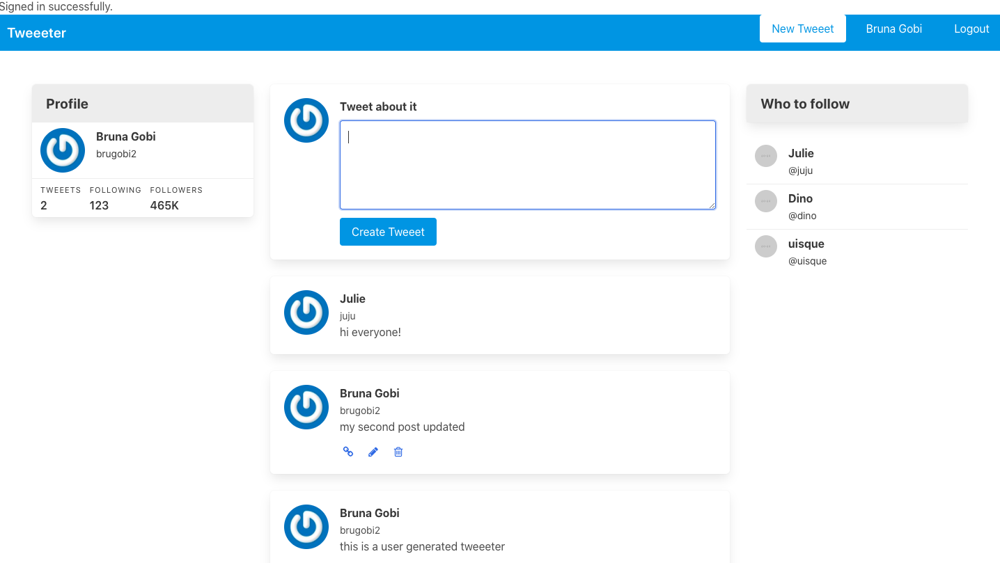

# Building a Twitter Clone
 
 This project was required by Microverse as part of the main curriculum which consists following along to **Andy Leverenz’s brilliant** Building a Twitter Clone screen casts tutorials avaible on his YouTube channel (https://www.youtube.com/channel/UCzePijHDYnVHIXW6HYTL4dg):

 - Let's Build: A Twitter Clone With Ruby on Rails - Part 1: https://www.youtube.com/watch?time_continue=1&v=5gUysPm64a4&feature=emb_logo
 - Let's Build: A Twitter Clone With Ruby on Rails - Part 2: https://www.youtube.com/watch?v=ZxkbFOe3lRY&t
 - Let's Build: A Twitter Clone With Ruby on Rails - Part 3: https://www.youtube.com/watch?v=V4h7-hR_WME

## Built With

- Ruby,
- Ruby on Rails,
- VSCode

## Getting Started

You can get a local copy of the repository please run the following commands on your terminal:

``$ cd <folder>                                        ``

``$ git clone git@github.com:brugobi/twitter-clone.git ``

## Playing with the application

- If you run the follow command on your terminal, you will be able to run the code on your web browser

``$ rails server           ``

- This app allows users to create posts and the authors of the posts are displayed only if as a User you are logged in

- After that you will be able to create, edit and delete new posts.

## Author

👤 **Bruna Gobi**

- Github: [@brugobi](https://github.com/brugobi)
- Twitter: [@BrunaGobi2](https://twitter.com/BrunaGobi2)
- Linkedin: [bruna-gobi](https://www.linkedin.com/in/bruna-gobi/)

## 🤝 Contributing

Contributions, issues and feature requests are welcome!

## Show your support

Give a ⭐️ if you like this project!

## Acknowledgments

- **Andy Leverenz**
- Hat tip to anyone whose code was used
- Inspiration
- Microverse
